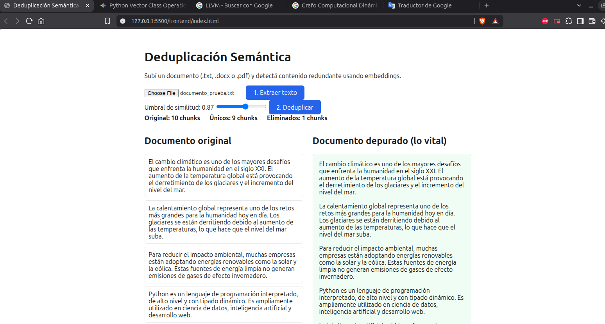

# Deduplicación Semántica de Documentos

Práctica de AI Engineering orientada a la deduplicación semántica de texto: se sube un documento (`.txt`, `.docx` o `.pdf`), se divide en párrafos, se generan embeddings de cada uno y se comparan por similitud coseno para identificar contenido redundante, aunque esté redactado de forma distinta.



El proyecto está dividido en dos partes independientes:

- **backend/**: API en FastAPI que extrae texto, genera embeddings y ejecuta el algoritmo de deduplicación.
- **frontend/**: interfaz en HTML/CSS/JS vanilla que consume la API y muestra el resultado (documento original vs. depurado).

## Hardware de desarrollo

Este proyecto se desarrolla y prueba sobre el siguiente equipo:

- CPU: Intel Core i5-7500
- RAM: 8GB DDR3 a 1866 MHz
- GPU: Asus GTX 970 Strix (4GB VRAM)

El pipeline corre completamente en CPU. La GPU no se utiliza en esta etapa: el modelo de embeddings elegido (`model2vec`, familia `potion-multilingual-128M`) es liviano y no requiere aceleración por hardware, y las versiones actuales de PyTorch dejaron de dar soporte a la arquitectura Maxwell (sm_52) de esta tarjeta. Se deja documentado por si más adelante se evalúa forzar una versión anterior de CUDA para sumar un módulo con modelo generativo.

## Requisitos

- Python 3.11+
- Extensión Live Server de VS Code (para servir el frontend)

## Instalación

Se recomienda trabajar con un entorno virtual para aislar las dependencias del proyecto:

```bash
cd backend
python -m venv venv

# Windows
venv\Scripts\activate

# Linux / macOS
source venv/bin/activate

pip install -r requirements.txt
```

El archivo `requirements.txt` se mantiene actualizado con `pip freeze > requirements.txt` cada vez que se suma o cambia alguna dependencia.

## Cómo correr el proyecto

1. Con el entorno virtual activado, dentro de `backend/`:

   ```bash
   uvicorn main:app --reload
   ```

   La API queda disponible en `http://127.0.0.1:8000` y la documentación interactiva en `http://127.0.0.1:8000/docs`.

2. Desde VS Code, clic derecho sobre `frontend/index.html` → **Open with Live Server**.

3. Se sube un documento de prueba, se extrae el texto, se ajusta el umbral de similitud y se ejecuta la deduplicación desde la interfaz.

## Estado del proyecto

En desarrollo. Este README se irá ampliando a medida que se sumen módulos (por ejemplo, soporte de OCR para PDFs escaneados o un paso de resumen adicional).

## TODO

- [ ] Mejorar README (secciones más detalladas, ejemplos de uso, capturas adicionales)
- [ ] Documentar con comentarios inline los bloques de código de cada archivo (backend y frontend)
- [ ] Agregar diagrama de flujo del pipeline (ASCII art o similar) para visualizar extracción → chunking → embeddings → dedup
- [ ] Graficar la matriz de similitud coseno para visualizar qué chunks se consideran "cerca" o "lejos" entre sí, y así justificar mejor el umbral elegido

> Checklist de pendientes técnicos. Se actualiza al cierre de cada sesión de trabajo, antes de hacer commit/push al repo.
